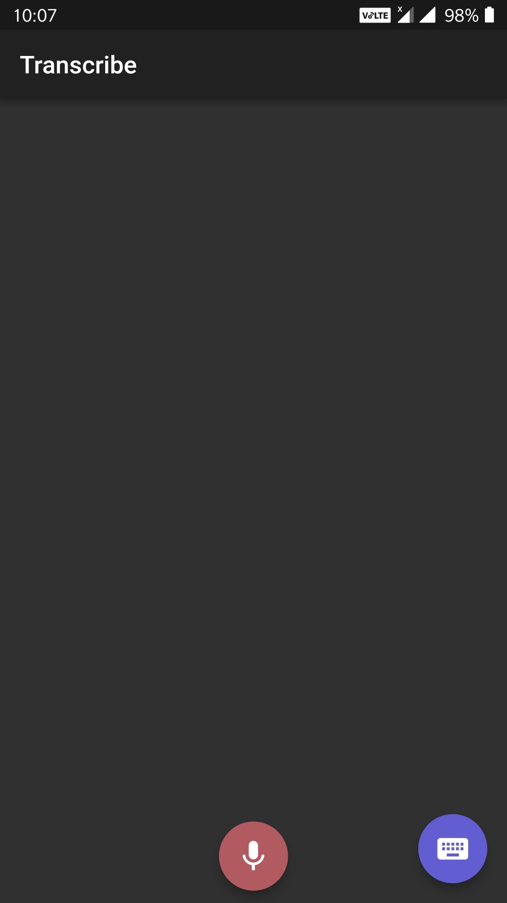

# flutter_voice_transcribe

Transcribe is developed for the people those who cannot hear(Deaf) and those who cannot speak(Dumb).
This app is inspired from Live Transcribe.

App Features:
• Deaf people can give voice input which is displayed on the screen (realtime speech to text conversion)
• Dumb people can reply by typing the text on the screen which is available in the app
• Available on Android API level 16 (4.1) (JELLY_BEAN) and later
• Security : Conversations are deleted automatically
• UI : Simple and easily accessible UI

App Permissions:
Access Microphone:

		<uses-permission android:name="android.permission.RECORD_AUDIO" /> 
		
This permission is required to take  voice input from the user.
		
&nbsp;&nbsp;

		
		
## Getting Started	

This project is a starting point for a Flutter application.

A few resources to get you started if this is your first Flutter project:

- [Lab: Write your first Flutter app](https://flutter.io/docs/get-started/codelab)
- [Cookbook: Useful Flutter samples](https://flutter.io/docs/cookbook)

For help getting started with Flutter, view our 
[online documentation](https://flutter.io/docs), which offers tutorials, 
samples, guidance on mobile development, and a full API reference.
